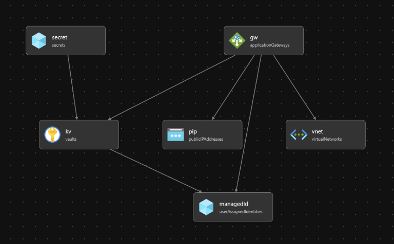

# Sandbox for team support

Bicep template here: [./infra/attempt-1.bicep](./infra/attempt-1.bicep)

## What it does
Template deploys:
  - Managed identity
  - KeyVault - and configures a policy such that the managed identity can get secrets
  - Application gateway (with some pre-reqs) and assigns the managed identity

__Please note__: the access policy is configured using the `.principalId` from the managed identity:

https://github.com/jochenvw/maximus-sandbox/blob/0d507d3e5f212df8fdca312ed4f03bd5790f82ef/infra/attemp-1.bicep#L19-L22

## Check

```
az keyvault show --name csu-nl-jvw-kv --resource-group csu-nl-jvw-maximus-sandbox --query "properties.accessPolicies"
```

Shows

```
[
  {
    "applicationId": null,
    "objectId": "[GUID of Object ID of managed identity (checked)]",
    "permissions": {
      "certificates": [],
      "keys": [],
      "secrets": [
        "get"
      ],
      "storage": null
    },
    "tenantId": "[hidden]"
  }
]
```


## Component diagram
